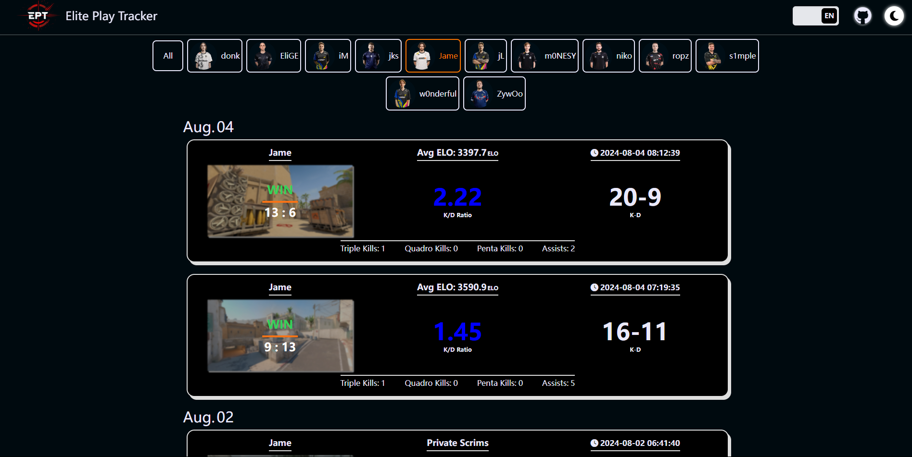

# Elite Play Tracker
<div align="center">
  <a href="https://eptracker.pro/#/" target='_blank'>
    
  </a>
  <div><strong>Elite Play Tracker</strong> 是一个跟踪CS2职业选手(目前都是职业选手)在Faceit平台上每一场对局的部分数据的web项目,对局数据由它的后端<a herf="https://github.com/zjssun/ElitePlay-Tracker-Express">ElitePlay-Tracker-Express</a>提供。</div>
  <div><strong>Elite Play Tracker</strong> is a web project that tracks partial data from every Faceit match played by CS2 pros (currently all pros), provided by its backend, <a herf="https://github.com/zjssun/ElitePlay-Tracker-Express">ElitePlay-Tracker-Express</a>.</div>
  
  <p>Screenshot of Elite Play Tracker</p>
</div>

## 部署到本地 (Deploy to Local)
1. 克隆仓库 Clone Repo
```
git clone https://github.com/zjssun/ElitePlayTracker-React.git
```
2. 安装依赖 Install Dependencies
```
npm install
```
3. 修改/src/utils/[api.ts](https://github.com/zjssun/ElitePlayTracker-React/blob/master/src/utils/api.ts)文件 Modify the api.ts file
```js
axios.defaults.baseURL = 'http://localhost:3000';//修改为你的后端地址 change to your backend address
```

4. 启动项目 Start Project
```
npm run dev
```