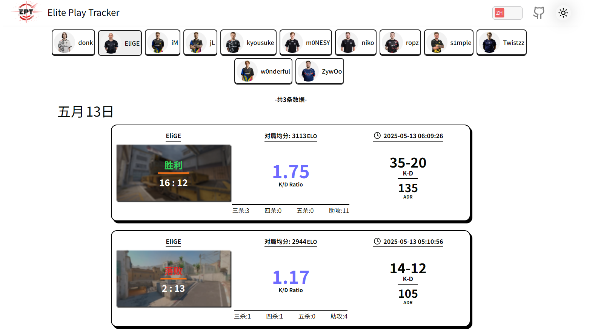

# Elite Play Tracker
<div align="center">
  <a href="https://eptracker.pro/donk/" target='_blank'>
    
  </a>
  <div><strong>Elite Play Tracker</strong> 是一个跟踪CS2职业选手(目前都是职业选手)在Faceit平台上每一场对局的部分数据的web项目,对局数据由它的后端 <a herf="https://github.com/zjssun/ElitePlay-Tracker-Express"><strike>ElitePlay-Tracker-Express</strike></a>👉<a herf="https://github.com/zjssun/api-hub">API-HUB</a>提供。</div>
  <div><strong>Elite Play Tracker</strong> is a web project that tracks partial data from every Faceit match played by CS2 pros (currently all pros), provided by its backend, <a herf="https://github.com/zjssun/ElitePlay-Tracker-Express"><strike>ElitePlay-Tracker-Express</strike></a>👉<a herf="https://github.com/zjssun/api-hub">API-HUB</a>.</div>
  
  <p>Screenshot of Elite Play Tracker</p>
</div>

---

## 技术支持 | Tech Stack 🚀

      

---

## 更新历史 | Update History 📜

**2025 年 5 月**  
- **2025-05-17**：放弃Tailwindcss🫡转为纯css因为它维护起来是真的令人头疼🔨,同时也更新了React-RouteV7,V7的framework路由更新的路由确实很不错🤓,重构中......
*Abandoned TailwindCSS 🫡 and switched to plain CSS — maintaining it was honestly a headache 🔨. Also updated to React Router v7 and started using its new framework-style routing — gotta say, the improvements are solid 🤓. Currently in the middle of a refactor...* 
- **2025-05-18**：基本上重构完了🤗，更新了职业哥的图片🩻，加上了几张新地图，用上了gasp的ScrollSmoother。
*Pretty much done with the refactor 🤗 — updated the pro player images 🩻, added a few new maps, and implemented GSAP's ScrollSmoother.*
- **2025-05-19**：添加了Google Analytics 📈统计网站浏览量,📍添加公告功能方便往后域名更改做通知。
*Added Google Analytics 📈 to track site traffic, and 📍introduced an announcement feature to easily notify users about future domain changes.*
---

## 部署到本地 | Deploy to Local
1. 克隆仓库 *Clone Repo*
```
git clone https://github.com/zjssun/ElitePlayTracker-React.git
```
2. 安装依赖 *Install Dependencies*
```
npm install
```
3. 修改/src/utils/[api.ts](https://github.com/zjssun/ElitePlayTracker-React/blob/master/src/utils/api.ts)文件 *Modify the api.ts file*
```js
axios.defaults.baseURL = 'http://localhost:3000';//修改为你的后端地址 change to your backend address
```

4. 启动项目 *Start Project*
```
npm run dev
```